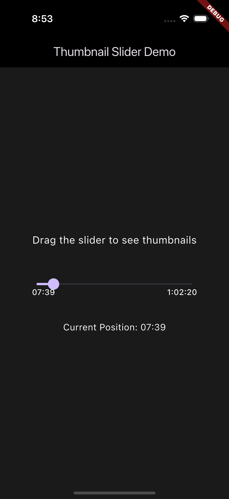

# Thumbnail Slider Example

A simple demo app showcasing the Thumbnail Slider package features.

## Features Demonstrated

- Thumbnail preview while dragging
- Custom thumbnail size and styling
- Time display (elapsed and remaining)
- Buffer indicator
- Dark theme integration

## Running the Example

1. Make sure you have Flutter installed
2. Run the following commands:
```bash
flutter pub get
flutter run
```

## Screenshot



## Code Example

```dart
SeekBar(
  duration: Duration(minutes: 5),
  position: position,
  bufferedPosition: position + Duration(seconds: 30),
  imageList: thumbnails,
  thumbnailWidth: 120,
  thumbnailHeight: 180,
  thumbnailBorderRadius: 12,
  onChanged: (position) {
    // Handle position change
  },
)
```
